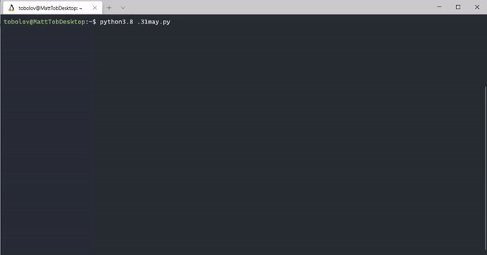

# Animated Motd Generator
Generates ones line of python 3.8 code which will print an animated message to the terminal. Terminal must support VT-100 escape sequeneces.

## Example:
[one-line-31may.py](one-line-31may.py)

## Notes
For a nice font, goto https://www.kammerl.de/ascii/AsciiSignature.php and use s-relief